Intersection_2062の出演者を紹介します。

<ol class="index">
    <h4>目次</h4>
    <li class="h2"><a href="#guestdj">Guest DJ</a></li>
        <li>　<a href="#hylen">Hylen</a></li>
        <li>　<a href="#rekka">雅賀烈賀（CAST：矢吹真央）</a></li>
        <li>　<a href="#naepiyo">naePi-YO</a></li>
    <li class="h2"><a href="#dj">DJ</a></li>
        <li>　<a href="#Cygnube">DJ Cygnube</a></li>
        <li>　<a href="#shiki">しき</a></li>
        <li>　<a href="#genka">大賀ルキア♡お気に入りの曲</a></li>
        <li>　<a href="#faio">黒胡椒揚げ</a></li>
        <li>　<a href="#mery">めり</a></li>
        <li>　<a href="#willow">ういろう</a></li>
    <li class="h2"><a href="#vj">VJ</a></li>
        <li>　<a href="#vindice">V!ndice</a></li>
        <li>　<a href="#maya">maya_Alukas</a></li>
        <li>　<a href="#72k">72K</a></li>
    <li class="h2"><a href="#lp">Live Paint</a></li>
        <li>　<a href="#suwa">s u w a</a></li>
    </li>
</ol>

 

<h2 id="guestdj">GUEST DJ</h2>

    <h3 id="hylen">Hylen</h3> 
    

        <a href="https://x.com/Hylen_JP" target="_blank">
            Follow on Twitter
            <svg viewBox="0 0 16 16" aria-hidden="true" width="32" height="32"
                ><path
                    fill="currentColor"
                    d="M5.026 15c6.038 0 9.341-5.003 9.341-9.334 0-.14 0-.282-.006-.422A6.685 6.685 0 0 0 16 3.542a6.658 6.658 0 0 1-1.889.518 3.301 3.301 0 0 0 1.447-1.817 6.533 6.533 0 0 1-2.087.793A3.286 3.286 0 0 0 7.875 6.03a9.325 9.325 0 0 1-6.767-3.429 3.289 3.289 0 0 0 1.018 4.382A3.323 3.323 0 0 1 .64 6.575v.045a3.288 3.288 0 0 0 2.632 3.218 3.203 3.203 0 0 1-.865.115 3.23 3.23 0 0 1-.614-.057 3.283 3.283 0 0 0 3.067 2.277A6.588 6.588 0 0 1 .78 13.58a6.32 6.32 0 0 1-.78-.045A9.344 9.344 0 0 0 5.026 15z"
                ></path></svg
            >
        </a>
    

    
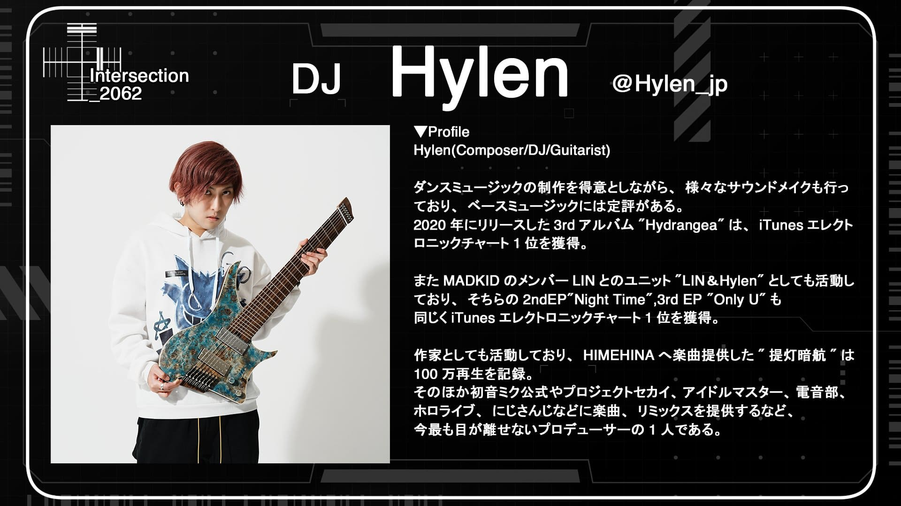

    <h3 id="rekka">雅賀烈賀（CAST：矢吹真央）</h3>  
    

        <a href="https://x.com/mao__y13" target="_blank">
            Follow on Twitter
            <svg viewBox="0 0 16 16" aria-hidden="true" width="32" height="32"
                ><path
                    fill="currentColor"
                    d="M5.026 15c6.038 0 9.341-5.003 9.341-9.334 0-.14 0-.282-.006-.422A6.685 6.685 0 0 0 16 3.542a6.658 6.658 0 0 1-1.889.518 3.301 3.301 0 0 0 1.447-1.817 6.533 6.533 0 0 1-2.087.793A3.286 3.286 0 0 0 7.875 6.03a9.325 9.325 0 0 1-6.767-3.429 3.289 3.289 0 0 0 1.018 4.382A3.323 3.323 0 0 1 .64 6.575v.045a3.288 3.288 0 0 0 2.632 3.218 3.203 3.203 0 0 1-.865.115 3.23 3.23 0 0 1-.614-.057 3.283 3.283 0 0 0 3.067 2.277A6.588 6.588 0 0 1 .78 13.58a6.32 6.32 0 0 1-.78-.045A9.344 9.344 0 0 0 5.026 15z"
                ></path></svg
            >
        </a>
    

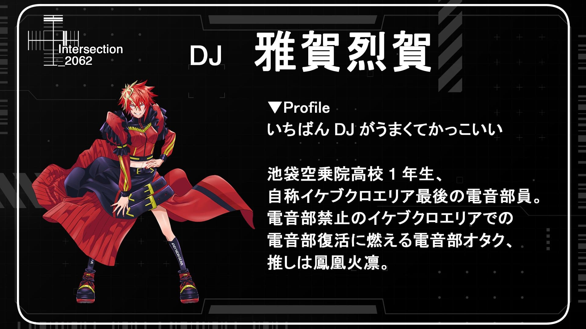

	<h3 id="naepiyo">naePi-YO</h3> 
	

		<a href="https://x.com/nae_ashiro" target="_blank">
			Follow on Twitter
				<svg viewBox="0 0 16 16" aria-hidden="true" width="32" height="32"
					><path
						fill="currentColor"
						d="M5.026 15c6.038 0 9.341-5.003 9.341-9.334 0-.14 0-.282-.006-.422A6.685 6.685 0 0 0 16 3.542a6.658 6.658 0 0 1-1.889.518 3.301 3.301 0 0 0 1.447-1.817 6.533 6.533 0 0 1-2.087.793A3.286 3.286 0 0 0 7.875 6.03a9.325 9.325 0 0 1-6.767-3.429 3.289 3.289 0 0 0 1.018 4.382A3.323 3.323 0 0 1 .64 6.575v.045a3.288 3.288 0 0 0 2.632 3.218 3.203 3.203 0 0 1-.865.115 3.23 3.23 0 0 1-.614-.057 3.283 3.283 0 0 0 3.067 2.277A6.588 6.588 0 0 1 .78 13.58a6.32 6.32 0 0 1-.78-.045A9.344 9.344 0 0 0 5.026 15z"
					></path></svg
				>
		</a>
	

<h2 id="dj">DJ</h2>

	<h3 id="Cygnube">DJ Cygnube</h3> 
	

		<a href="https://x.com/albNo273" target="_blank">
			Follow on Twitter
				<svg viewBox="0 0 16 16" aria-hidden="true" width="32" height="32"
					><path
						fill="currentColor"
						d="M5.026 15c6.038 0 9.341-5.003 9.341-9.334 0-.14 0-.282-.006-.422A6.685 6.685 0 0 0 16 3.542a6.658 6.658 0 0 1-1.889.518 3.301 3.301 0 0 0 1.447-1.817 6.533 6.533 0 0 1-2.087.793A3.286 3.286 0 0 0 7.875 6.03a9.325 9.325 0 0 1-6.767-3.429 3.289 3.289 0 0 0 1.018 4.382A3.323 3.323 0 0 1 .64 6.575v.045a3.288 3.288 0 0 0 2.632 3.218 3.203 3.203 0 0 1-.865.115 3.23 3.23 0 0 1-.614-.057 3.283 3.283 0 0 0 3.067 2.277A6.588 6.588 0 0 1 .78 13.58a6.32 6.32 0 0 1-.78-.045A9.344 9.344 0 0 0 5.026 15z"
					></path></svg
				>
		</a>
	

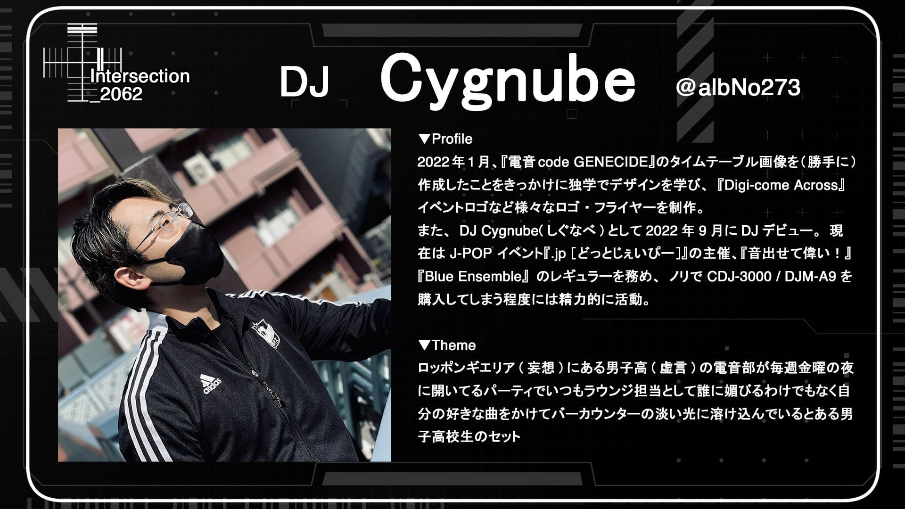

	<h3 id="shiki">しき</h3>  
	

		<a href="https://x.com/4_ki_ta" target="_blank">
			Follow on Twitter
				<svg viewBox="0 0 16 16" aria-hidden="true" width="32" height="32"
					><path
						fill="currentColor"
						d="M5.026 15c6.038 0 9.341-5.003 9.341-9.334 0-.14 0-.282-.006-.422A6.685 6.685 0 0 0 16 3.542a6.658 6.658 0 0 1-1.889.518 3.301 3.301 0 0 0 1.447-1.817 6.533 6.533 0 0 1-2.087.793A3.286 3.286 0 0 0 7.875 6.03a9.325 9.325 0 0 1-6.767-3.429 3.289 3.289 0 0 0 1.018 4.382A3.323 3.323 0 0 1 .64 6.575v.045a3.288 3.288 0 0 0 2.632 3.218 3.203 3.203 0 0 1-.865.115 3.23 3.23 0 0 1-.614-.057 3.283 3.283 0 0 0 3.067 2.277A6.588 6.588 0 0 1 .78 13.58a6.32 6.32 0 0 1-.78-.045A9.344 9.344 0 0 0 5.026 15z"
					></path></svg
				>
		</a>
	

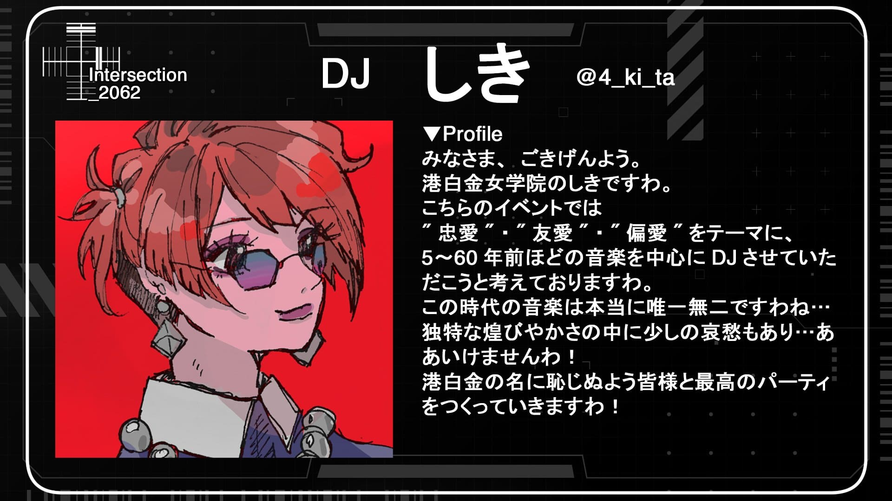

<h3 id="genka">大賀ルキア♡お気に入りの曲</h3> 

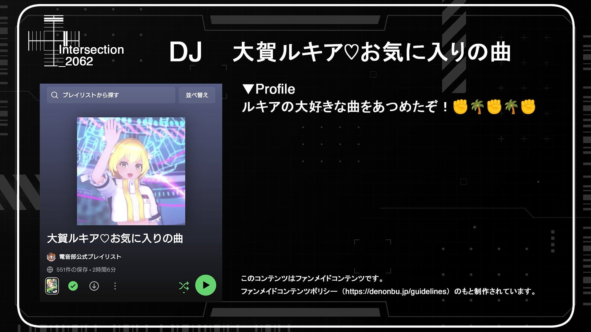

	<h3 id="faio">黒胡椒揚げ</h3> 
	

		<a href="https://x.com/BP_renkon" target="_blank">
			Follow on Twitter
				<svg viewBox="0 0 16 16" aria-hidden="true" width="32" height="32"
					><path
						fill="currentColor"
						d="M5.026 15c6.038 0 9.341-5.003 9.341-9.334 0-.14 0-.282-.006-.422A6.685 6.685 0 0 0 16 3.542a6.658 6.658 0 0 1-1.889.518 3.301 3.301 0 0 0 1.447-1.817 6.533 6.533 0 0 1-2.087.793A3.286 3.286 0 0 0 7.875 6.03a9.325 9.325 0 0 1-6.767-3.429 3.289 3.289 0 0 0 1.018 4.382A3.323 3.323 0 0 1 .64 6.575v.045a3.288 3.288 0 0 0 2.632 3.218 3.203 3.203 0 0 1-.865.115 3.23 3.23 0 0 1-.614-.057 3.283 3.283 0 0 0 3.067 2.277A6.588 6.588 0 0 1 .78 13.58a6.32 6.32 0 0 1-.78-.045A9.344 9.344 0 0 0 5.026 15z"
					></path></svg
				>
		</a>
	

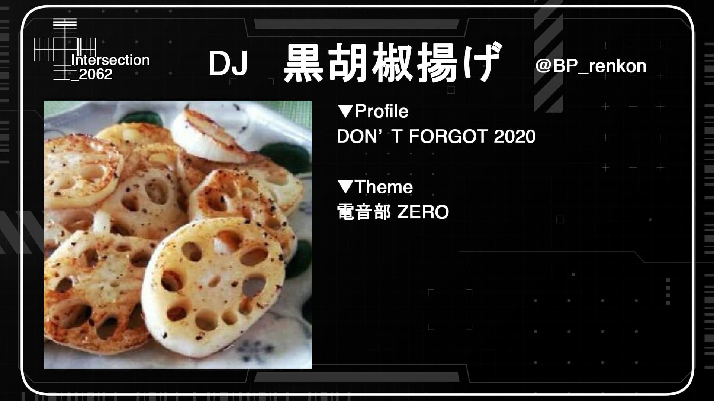

	<h3 id="mery">めり</h3> 
	

		<a href="https://x.com/d1ggtter" target="_blank">
			Follow on Twitter
				<svg viewBox="0 0 16 16" aria-hidden="true" width="32" height="32"
					><path
						fill="currentColor"
						d="M5.026 15c6.038 0 9.341-5.003 9.341-9.334 0-.14 0-.282-.006-.422A6.685 6.685 0 0 0 16 3.542a6.658 6.658 0 0 1-1.889.518 3.301 3.301 0 0 0 1.447-1.817 6.533 6.533 0 0 1-2.087.793A3.286 3.286 0 0 0 7.875 6.03a9.325 9.325 0 0 1-6.767-3.429 3.289 3.289 0 0 0 1.018 4.382A3.323 3.323 0 0 1 .64 6.575v.045a3.288 3.288 0 0 0 2.632 3.218 3.203 3.203 0 0 1-.865.115 3.23 3.23 0 0 1-.614-.057 3.283 3.283 0 0 0 3.067 2.277A6.588 6.588 0 0 1 .78 13.58a6.32 6.32 0 0 1-.78-.045A9.344 9.344 0 0 0 5.026 15z"
					></path></svg
				>
		</a>
	

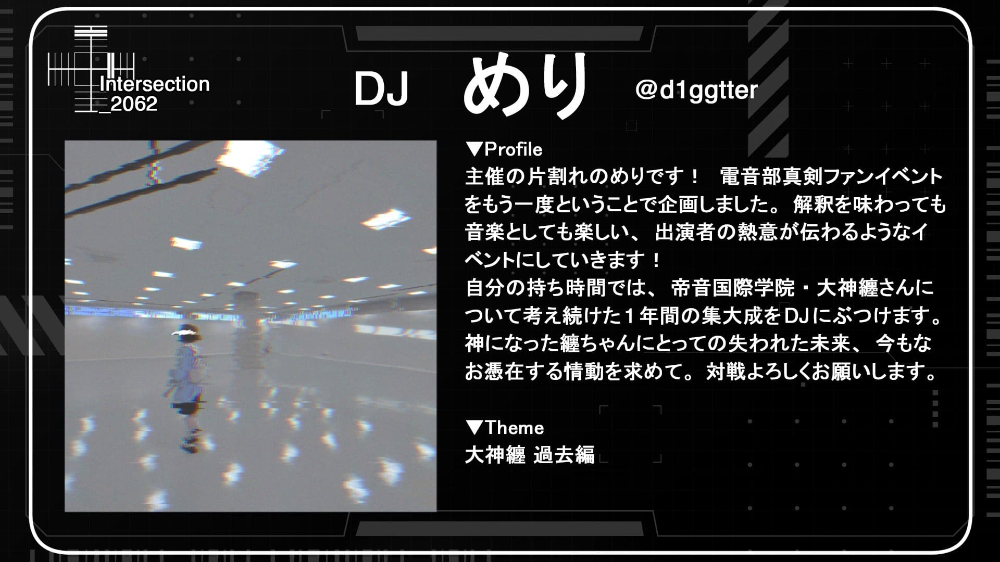

	<h3 id="willow">ういろう</h3> 
	

		<a href="https://x.com/willow_2b" target="_blank">
			Follow on Twitter
				<svg viewBox="0 0 16 16" aria-hidden="true" width="32" height="32"
					><path
						fill="currentColor"
						d="M5.026 15c6.038 0 9.341-5.003 9.341-9.334 0-.14 0-.282-.006-.422A6.685 6.685 0 0 0 16 3.542a6.658 6.658 0 0 1-1.889.518 3.301 3.301 0 0 0 1.447-1.817 6.533 6.533 0 0 1-2.087.793A3.286 3.286 0 0 0 7.875 6.03a9.325 9.325 0 0 1-6.767-3.429 3.289 3.289 0 0 0 1.018 4.382A3.323 3.323 0 0 1 .64 6.575v.045a3.288 3.288 0 0 0 2.632 3.218 3.203 3.203 0 0 1-.865.115 3.23 3.23 0 0 1-.614-.057 3.283 3.283 0 0 0 3.067 2.277A6.588 6.588 0 0 1 .78 13.58a6.32 6.32 0 0 1-.78-.045A9.344 9.344 0 0 0 5.026 15z"
					></path></svg
				>
		</a>
	

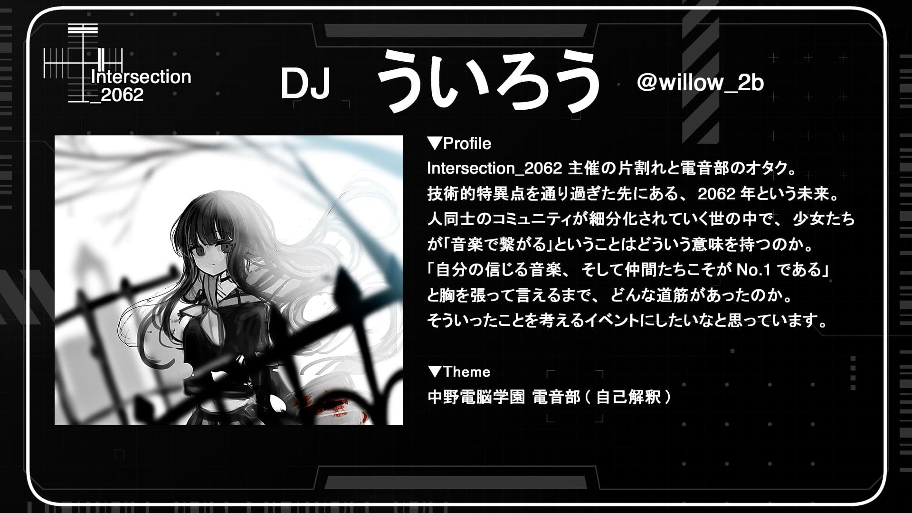

<h2 id="vj">VJ</h2>

	<h3 id="vindice">V!ndice</h3> 
	

		<a href="https://x.com/vindice0" target="_blank">
			Follow on Twitter
				<svg viewBox="0 0 16 16" aria-hidden="true" width="32" height="32"
					><path
						fill="currentColor"
						d="M5.026 15c6.038 0 9.341-5.003 9.341-9.334 0-.14 0-.282-.006-.422A6.685 6.685 0 0 0 16 3.542a6.658 6.658 0 0 1-1.889.518 3.301 3.301 0 0 0 1.447-1.817 6.533 6.533 0 0 1-2.087.793A3.286 3.286 0 0 0 7.875 6.03a9.325 9.325 0 0 1-6.767-3.429 3.289 3.289 0 0 0 1.018 4.382A3.323 3.323 0 0 1 .64 6.575v.045a3.288 3.288 0 0 0 2.632 3.218 3.203 3.203 0 0 1-.865.115 3.23 3.23 0 0 1-.614-.057 3.283 3.283 0 0 0 3.067 2.277A6.588 6.588 0 0 1 .78 13.58a6.32 6.32 0 0 1-.78-.045A9.344 9.344 0 0 0 5.026 15z"
					></path></svg
				>
		</a>
	

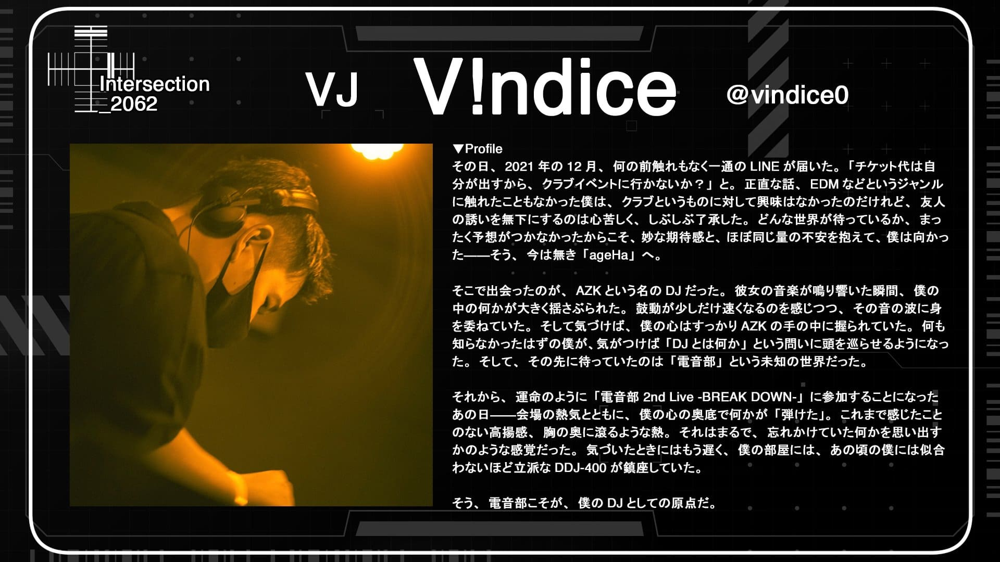

	<h3 id="maya">maya_Alukas</h3> 
	

		<a href="https://x.com/maya_Alukas" target="_blank">
			Follow on Twitter
				<svg viewBox="0 0 16 16" aria-hidden="true" width="32" height="32"
					><path
						fill="currentColor"
						d="M5.026 15c6.038 0 9.341-5.003 9.341-9.334 0-.14 0-.282-.006-.422A6.685 6.685 0 0 0 16 3.542a6.658 6.658 0 0 1-1.889.518 3.301 3.301 0 0 0 1.447-1.817 6.533 6.533 0 0 1-2.087.793A3.286 3.286 0 0 0 7.875 6.03a9.325 9.325 0 0 1-6.767-3.429 3.289 3.289 0 0 0 1.018 4.382A3.323 3.323 0 0 1 .64 6.575v.045a3.288 3.288 0 0 0 2.632 3.218 3.203 3.203 0 0 1-.865.115 3.23 3.23 0 0 1-.614-.057 3.283 3.283 0 0 0 3.067 2.277A6.588 6.588 0 0 1 .78 13.58a6.32 6.32 0 0 1-.78-.045A9.344 9.344 0 0 0 5.026 15z"
					></path></svg
				>
		</a>
	

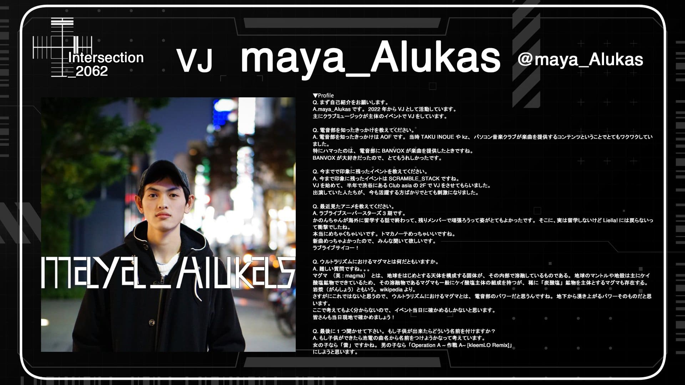

	<h3 id="72k">72K</h3> 
	

		<a href="https://x.com/72K_Nanika" target="_blank">
			Follow on Twitter
				<svg viewBox="0 0 16 16" aria-hidden="true" width="32" height="32"
					><path
						fill="currentColor"
						d="M5.026 15c6.038 0 9.341-5.003 9.341-9.334 0-.14 0-.282-.006-.422A6.685 6.685 0 0 0 16 3.542a6.658 6.658 0 0 1-1.889.518 3.301 3.301 0 0 0 1.447-1.817 6.533 6.533 0 0 1-2.087.793A3.286 3.286 0 0 0 7.875 6.03a9.325 9.325 0 0 1-6.767-3.429 3.289 3.289 0 0 0 1.018 4.382A3.323 3.323 0 0 1 .64 6.575v.045a3.288 3.288 0 0 0 2.632 3.218 3.203 3.203 0 0 1-.865.115 3.23 3.23 0 0 1-.614-.057 3.283 3.283 0 0 0 3.067 2.277A6.588 6.588 0 0 1 .78 13.58a6.32 6.32 0 0 1-.78-.045A9.344 9.344 0 0 0 5.026 15z"
					></path></svg
				>
		</a>
	

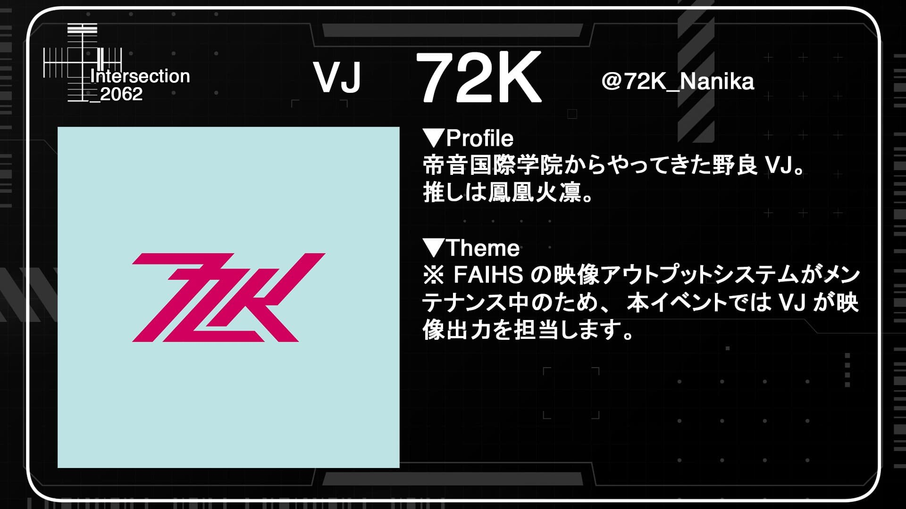

<h2 id="lp">Live Paint</h2>

	<h3 id="suwa">s u w a</h3> 
	

		<a href="https://x.com/nemuri_munya" target="_blank">
			Follow on Twitter
				<svg viewBox="0 0 16 16" aria-hidden="true" width="32" height="32"
					><path
						fill="currentColor"
						d="M5.026 15c6.038 0 9.341-5.003 9.341-9.334 0-.14 0-.282-.006-.422A6.685 6.685 0 0 0 16 3.542a6.658 6.658 0 0 1-1.889.518 3.301 3.301 0 0 0 1.447-1.817 6.533 6.533 0 0 1-2.087.793A3.286 3.286 0 0 0 7.875 6.03a9.325 9.325 0 0 1-6.767-3.429 3.289 3.289 0 0 0 1.018 4.382A3.323 3.323 0 0 1 .64 6.575v.045a3.288 3.288 0 0 0 2.632 3.218 3.203 3.203 0 0 1-.865.115 3.23 3.23 0 0 1-.614-.057 3.283 3.283 0 0 0 3.067 2.277A6.588 6.588 0 0 1 .78 13.58a6.32 6.32 0 0 1-.78-.045A9.344 9.344 0 0 0 5.026 15z"
					></path></svg
				>
		</a>
	

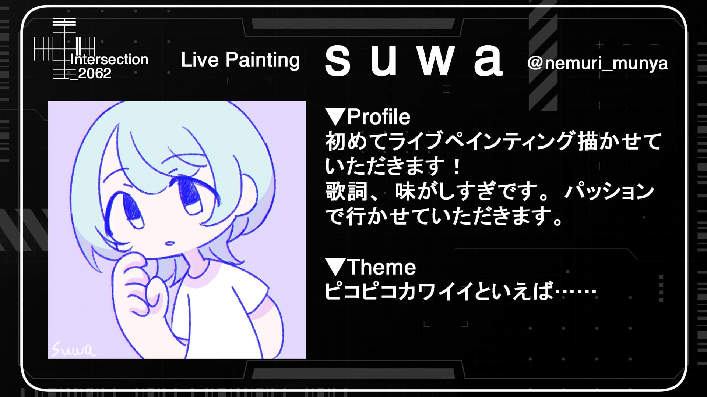

