Intersection_2062 2ndの出演者を紹介します。
ブッキングに込めた思いは<a href="https://intersection2062.com/blog/intersection_SL/">こちら</a>から！

<ol class="index">
    <h4>目次</h4>
    <li class="h2"><a href="#guestdj">Guest DJ</a></li>
        <li>　<a href="#higma">higma</a></li>
        <li>　<a href="#nuushi">NUU$HI</a></li>
        <li>　<a href="#tatarayura">駒場伶音(CAST:多々良ゆら)</a></li>
    <li class="h2"><a href="#dj">DJ</a></li>
        <li>　<a href="#faio">FAIO</a></li>
        <li>　<a href="#pogo">POGO</a></li>
        <li>　<a href="#macaneko">まかねこ</a></li>
        <li>　<a href="#shopon">しょうぽん</a></li>
         <li>　<a href="#mery">めり</a></li>
        <li>　<a href="#willow">ういろう</a></li>
    <li class="h2"><a href="#vj">VJ</a></li>
        <li>　<a href="#72k">72K</a></li>
        <li>　<a href="#maya">maya_Alukas</a></li>
        <li>　<a href="#nemo">VJ Nemo</a></li>
    <li class="h2"><a href="#lp">Live Painter</a></li>
        <li>　<a href="#tattun">たっつん</a></li>
    </li>
</ol>

 

<h2 id="guestdj">GUEST DJ</h2>

    <h3 id="higma"> higma </h3> 
    

        <a href="https://x.com/pai_dareka" target="_blank">
            Follow on Twitter
            <svg viewBox="0 0 16 16" aria-hidden="true" width="32" height="32"
                ><path
                    fill="currentColor"
                    d="M5.026 15c6.038 0 9.341-5.003 9.341-9.334 0-.14 0-.282-.006-.422A6.685 6.685 0 0 0 16 3.542a6.658 6.658 0 0 1-1.889.518 3.301 3.301 0 0 0 1.447-1.817 6.533 6.533 0 0 1-2.087.793A3.286 3.286 0 0 0 7.875 6.03a9.325 9.325 0 0 1-6.767-3.429 3.289 3.289 0 0 0 1.018 4.382A3.323 3.323 0 0 1 .64 6.575v.045a3.288 3.288 0 0 0 2.632 3.218 3.203 3.203 0 0 1-.865.115 3.23 3.23 0 0 1-.614-.057 3.283 3.283 0 0 0 3.067 2.277A6.588 6.588 0 0 1 .78 13.58a6.32 6.32 0 0 1-.78-.045A9.344 9.344 0 0 0 5.026 15z"
                ></path></svg
            >
        </a>
    

    

ボカロP・トラックメーカー。

2019年より活動開始 
多様なジャンルを融合させたサウンドを創造し、言葉では表現できない感情を音楽へと昇華する。 
自主制作作品を精力的に発表する傍ら、Sou、莉犬、9Lanaなどへの楽曲提供を手がける作家としても活動中。 
MVやアートワークも自身で手掛け、音楽にとどまらない多彩な表現活動を展開している。 
カレーが好き

#### Theme
ボカロ、クラブミュージック、電音部楽曲

    <h3 id="nuushi">NUU$HI</h3>  
    

        <a href="https://x.com/IamNuushi" target="_blank">
            Follow on Twitter
            <svg viewBox="0 0 16 16" aria-hidden="true" width="32" height="32"
                ><path
                    fill="currentColor"
                    d="M5.026 15c6.038 0 9.341-5.003 9.341-9.334 0-.14 0-.282-.006-.422A6.685 6.685 0 0 0 16 3.542a6.658 6.658 0 0 1-1.889.518 3.301 3.301 0 0 0 1.447-1.817 6.533 6.533 0 0 1-2.087.793A3.286 3.286 0 0 0 7.875 6.03a9.325 9.325 0 0 1-6.767-3.429 3.289 3.289 0 0 0 1.018 4.382A3.323 3.323 0 0 1 .64 6.575v.045a3.288 3.288 0 0 0 2.632 3.218 3.203 3.203 0 0 1-.865.115 3.23 3.23 0 0 1-.614-.057 3.283 3.283 0 0 0 3.067 2.277A6.588 6.588 0 0 1 .78 13.58a6.32 6.32 0 0 1-.78-.045A9.344 9.344 0 0 0 5.026 15z"
                ></path></svg
            >
        </a>
    

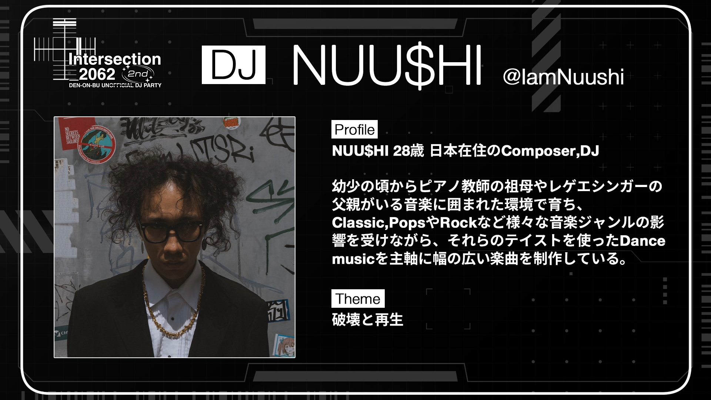

NUU$HI 28歳 日本在住のComposer,DJ

幼少の頃からピアノ教師の祖母やレゲエシンガーの父親がいる音楽に囲まれた環境で育ち、Classic,Pops や Rockなど様々な音楽ジャンルの影響を受けながら、それらのテイストを使ったDance musicを主軸に幅の広い楽曲を制作している。

#### Theme
破壊と再生

	<h3 id="tatarayura">駒場伶音(CAST:多々良ゆら)</h3> 
	

		<a href="https://x.com/MSP_yura" target="_blank">
			Follow on Twitter
				<svg viewBox="0 0 16 16" aria-hidden="true" width="32" height="32"
					><path
						fill="currentColor"
						d="M5.026 15c6.038 0 9.341-5.003 9.341-9.334 0-.14 0-.282-.006-.422A6.685 6.685 0 0 0 16 3.542a6.658 6.658 0 0 1-1.889.518 3.301 3.301 0 0 0 1.447-1.817 6.533 6.533 0 0 1-2.087.793A3.286 3.286 0 0 0 7.875 6.03a9.325 9.325 0 0 1-6.767-3.429 3.289 3.289 0 0 0 1.018 4.382A3.323 3.323 0 0 1 .64 6.575v.045a3.288 3.288 0 0 0 2.632 3.218 3.203 3.203 0 0 1-.865.115 3.23 3.23 0 0 1-.614-.057 3.283 3.283 0 0 0 3.067 2.277A6.588 6.588 0 0 1 .78 13.58a6.32 6.32 0 0 1-.78-.045A9.344 9.344 0 0 0 5.026 15z"
					></path></svg
				>
		</a>
	

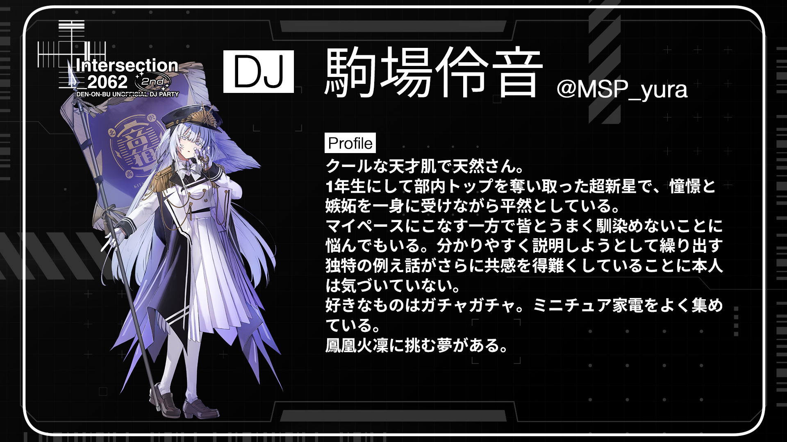

クールな天才肌で天然さん。 
1年生にして部内トップを奪い取った超新星で、憧憬と嫉妬を一身に受けながら平然としている。 
マイペースにこなす一方で皆とうまく馴染めないことに悩んでもいる。分かりやすく説明しようとして繰り出す独特の例え話がさらに共感を得難くしていることに本人は気づいていない。 
好きなものはガチャガチャ。ミニチュア家電をよく集めている。 
鳳凰火凜に挑む夢がある。

<h2 id="dj">DJ</h2>

	<h3 id="faio">FAIO</h3> 
	

		<a href="https://x.com/FAIO1230" target="_blank">
			Follow on Twitter
				<svg viewBox="0 0 16 16" aria-hidden="true" width="32" height="32"
					><path
						fill="currentColor"
						d="M5.026 15c6.038 0 9.341-5.003 9.341-9.334 0-.14 0-.282-.006-.422A6.685 6.685 0 0 0 16 3.542a6.658 6.658 0 0 1-1.889.518 3.301 3.301 0 0 0 1.447-1.817 6.533 6.533 0 0 1-2.087.793A3.286 3.286 0 0 0 7.875 6.03a9.325 9.325 0 0 1-6.767-3.429 3.289 3.289 0 0 0 1.018 4.382A3.323 3.323 0 0 1 .64 6.575v.045a3.288 3.288 0 0 0 2.632 3.218 3.203 3.203 0 0 1-.865.115 3.23 3.23 0 0 1-.614-.057 3.283 3.283 0 0 0 3.067 2.277A6.588 6.588 0 0 1 .78 13.58a6.32 6.32 0 0 1-.78-.045A9.344 9.344 0 0 0 5.026 15z"
					></path></svg
				>
		</a>
	

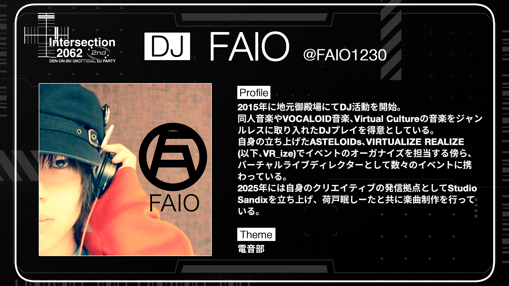

2015年に地元御殿場にてDJ活動を開始。 
同人音楽やVOCALOID音楽、Virtual Cultureの音楽をジャンルレスに取り入れたDJプレイを得意としている。 
自身の立ち上げたASTELOIDs、VIRTUALIZE REALIZE(以下、VR_ize)でイベントのオーガナイズを担当する傍ら、バーチャルライブディレクターとして数々のイベントに携わっている。 
2025年には自身のクリエイティブの発信拠点としてStudio Sandixを立ち上げ、荷戸眠しーたと共に楽曲制作を行っている。

#### Theme
電音部

	<h3 id="pogo">POGO</h3>  
	

		<a href="https://x.com/pogo_voc" target="_blank">
			Follow on Twitter
				<svg viewBox="0 0 16 16" aria-hidden="true" width="32" height="32"
					><path
						fill="currentColor"
						d="M5.026 15c6.038 0 9.341-5.003 9.341-9.334 0-.14 0-.282-.006-.422A6.685 6.685 0 0 0 16 3.542a6.658 6.658 0 0 1-1.889.518 3.301 3.301 0 0 0 1.447-1.817 6.533 6.533 0 0 1-2.087.793A3.286 3.286 0 0 0 7.875 6.03a9.325 9.325 0 0 1-6.767-3.429 3.289 3.289 0 0 0 1.018 4.382A3.323 3.323 0 0 1 .64 6.575v.045a3.288 3.288 0 0 0 2.632 3.218 3.203 3.203 0 0 1-.865.115 3.23 3.23 0 0 1-.614-.057 3.283 3.283 0 0 0 3.067 2.277A6.588 6.588 0 0 1 .78 13.58a6.32 6.32 0 0 1-.78-.045A9.344 9.344 0 0 0 5.026 15z"
					></path></svg
				>
		</a>
	

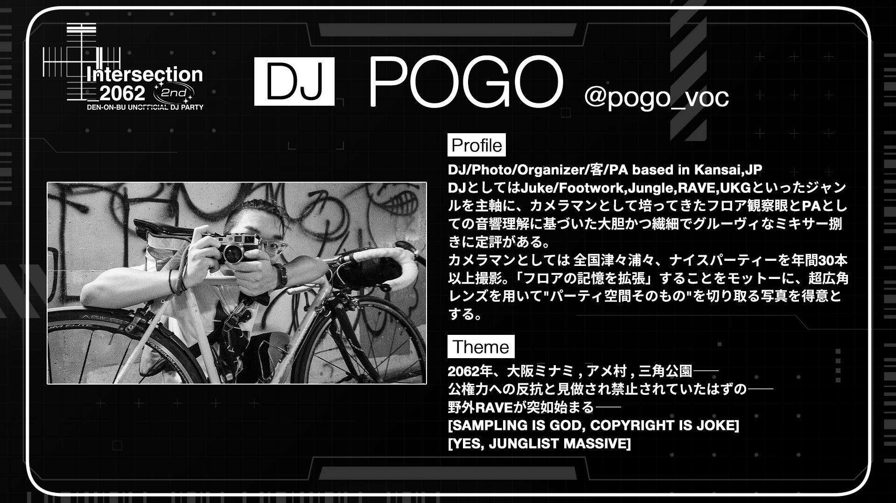

DJ/Photo/Organizer/客/PA based in Kansai,JP 
DJとしては Juke/Footwork,Jungle,RAVE,UKG といったジャンルを主軸に、カメラマンとして培ってきたフロア観察眼とPAとしての音響理解に基づいた大胆かつ繊細でグルーヴィなミキサー捌きに定評がある。 
カメラマンとしては 全国津々浦々、ナイスパーティーを年間30本以上撮影。「フロアの記憶を拡張」することをモットーに、超広角レンズを用いて"パーティ空間そのもの"を切り取る写真を得意とする。 

#### Theme
2062年、大阪ミナミ,アメ村,三角公園―― 
公権力への反抗と見做され禁止されていたはずの―― 
野外RAVEが突如始まる―― 

[SAMPLING IS GOD, COPYRIGHT IS JOKE] 
[YES, JUNGLIST MASSIVE] 

	<h3 id="macaneko">まかねこ</h3> 
	

		<a href="https://x.com/macat_255" target="_blank">
			Follow on Twitter
				<svg viewBox="0 0 16 16" aria-hidden="true" width="32" height="32"
					><path
						fill="currentColor"
						d="M5.026 15c6.038 0 9.341-5.003 9.341-9.334 0-.14 0-.282-.006-.422A6.685 6.685 0 0 0 16 3.542a6.658 6.658 0 0 1-1.889.518 3.301 3.301 0 0 0 1.447-1.817 6.533 6.533 0 0 1-2.087.793A3.286 3.286 0 0 0 7.875 6.03a9.325 9.325 0 0 1-6.767-3.429 3.289 3.289 0 0 0 1.018 4.382A3.323 3.323 0 0 1 .64 6.575v.045a3.288 3.288 0 0 0 2.632 3.218 3.203 3.203 0 0 1-.865.115 3.23 3.23 0 0 1-.614-.057 3.283 3.283 0 0 0 3.067 2.277A6.588 6.588 0 0 1 .78 13.58a6.32 6.32 0 0 1-.78-.045A9.344 9.344 0 0 0 5.026 15z"
					></path></svg
				>
		</a>
	

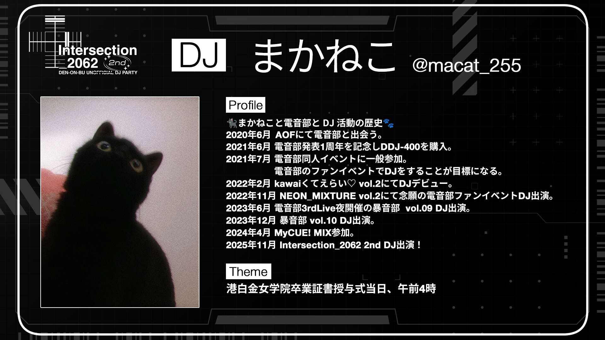

🐈‍⬛まかねこと電音部とDJ活動の歴史🐾 
2020年6月 AOFにて電音部と出会う。 
2021年6月 電音部発表1周年を記念しDDJ-400を購入。 
2021年7月 電音部同人イベントに一般参加。電音部のファンイベントでDJをすることが目標になる。 
2022年2月 kawaiくてえらい♡ vol.2にてDJデビュー。 
2022年11月 NEON_MIXTURE vol.2にて念願の電音部ファンイベントDJ出演。 
2023年6月 電音部3rdLive夜開催の暴音部  vol.09 DJ出演。 
2023年12月 暴音部 vol.10 DJ出演。 
2024年4月 MyCUE! MIX参加。 
2025年11月 Intersection_2062 2nd DJ出演！

#### Theme
港白金女学院卒業証書授与式当日、午前4時

	<h3 id="shopon">しょうぽん</h3> 
	

		<a href="https://x.com/shopon1201" target="_blank">
			Follow on Twitter
				<svg viewBox="0 0 16 16" aria-hidden="true" width="32" height="32"
					><path
						fill="currentColor"
						d="M5.026 15c6.038 0 9.341-5.003 9.341-9.334 0-.14 0-.282-.006-.422A6.685 6.685 0 0 0 16 3.542a6.658 6.658 0 0 1-1.889.518 3.301 3.301 0 0 0 1.447-1.817 6.533 6.533 0 0 1-2.087.793A3.286 3.286 0 0 0 7.875 6.03a9.325 9.325 0 0 1-6.767-3.429 3.289 3.289 0 0 0 1.018 4.382A3.323 3.323 0 0 1 .64 6.575v.045a3.288 3.288 0 0 0 2.632 3.218 3.203 3.203 0 0 1-.865.115 3.23 3.23 0 0 1-.614-.057 3.283 3.283 0 0 0 3.067 2.277A6.588 6.588 0 0 1 .78 13.58a6.32 6.32 0 0 1-.78-.045A9.344 9.344 0 0 0 5.026 15z"
					></path></svg
				>
		</a>
	

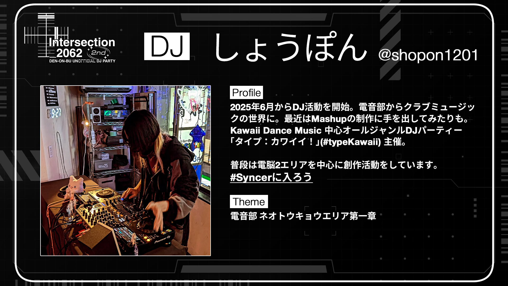

2025年6月からDJ活動を開始。電音部からクラブミュージックの世界に。最近はMashupの制作に手を出してみたりも。Kawaii Dance Music 中心オールジャンルDJパーティー「タイプ：カワイイ！」(#typeKawaii) 主催。

普段は電脳２エリアを中心に創作活動をしています。#Syncerに入ろう

	<h3 id="mery">めり</h3> 
	

		<a href="https://x.com/d1ggtter" target="_blank">
			Follow on Twitter
				<svg viewBox="0 0 16 16" aria-hidden="true" width="32" height="32"
					><path
						fill="currentColor"
						d="M5.026 15c6.038 0 9.341-5.003 9.341-9.334 0-.14 0-.282-.006-.422A6.685 6.685 0 0 0 16 3.542a6.658 6.658 0 0 1-1.889.518 3.301 3.301 0 0 0 1.447-1.817 6.533 6.533 0 0 1-2.087.793A3.286 3.286 0 0 0 7.875 6.03a9.325 9.325 0 0 1-6.767-3.429 3.289 3.289 0 0 0 1.018 4.382A3.323 3.323 0 0 1 .64 6.575v.045a3.288 3.288 0 0 0 2.632 3.218 3.203 3.203 0 0 1-.865.115 3.23 3.23 0 0 1-.614-.057 3.283 3.283 0 0 0 3.067 2.277A6.588 6.588 0 0 1 .78 13.58a6.32 6.32 0 0 1-.78-.045A9.344 9.344 0 0 0 5.026 15z"
					></path></svg
				>
		</a>
	

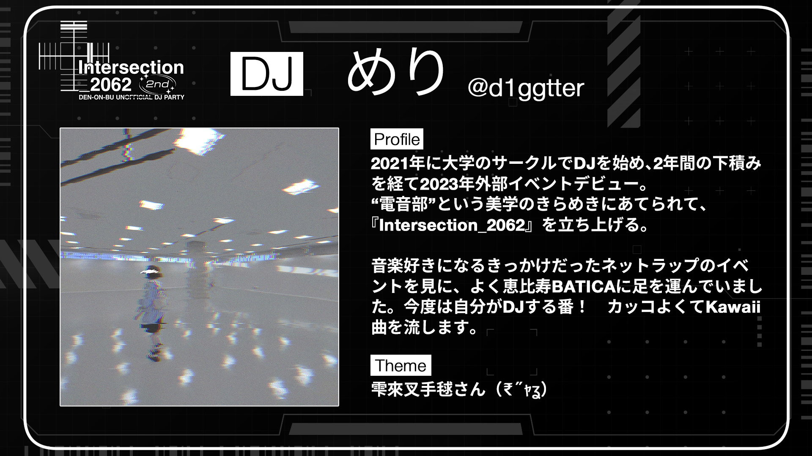

2021年に大学のサークルでDJを始め、2年間の下積みを経て2023年外部イベントデビュー。 
“電音部”という美学のきらめきにあてられて、『Intersection_2062』を立ち上げる。 

音楽好きになるきっかけだったネットラップのイベントを見に、よく恵比寿BATICAに足を運んでいました。今度は自分がDJする番！　カッコよくてKawaii曲を流します。 

#### Theme
雫來叉手毬さん（₹˝ｬʓ）

	<h3 id="willow">ういろう</h3> 
	

		<a href="https://x.com/willow_2b" target="_blank">
			Follow on Twitter
				<svg viewBox="0 0 16 16" aria-hidden="true" width="32" height="32"
					><path
						fill="currentColor"
						d="M5.026 15c6.038 0 9.341-5.003 9.341-9.334 0-.14 0-.282-.006-.422A6.685 6.685 0 0 0 16 3.542a6.658 6.658 0 0 1-1.889.518 3.301 3.301 0 0 0 1.447-1.817 6.533 6.533 0 0 1-2.087.793A3.286 3.286 0 0 0 7.875 6.03a9.325 9.325 0 0 1-6.767-3.429 3.289 3.289 0 0 0 1.018 4.382A3.323 3.323 0 0 1 .64 6.575v.045a3.288 3.288 0 0 0 2.632 3.218 3.203 3.203 0 0 1-.865.115 3.23 3.23 0 0 1-.614-.057 3.283 3.283 0 0 0 3.067 2.277A6.588 6.588 0 0 1 .78 13.58a6.32 6.32 0 0 1-.78-.045A9.344 9.344 0 0 0 5.026 15z"
					></path></svg
				>
		</a>
	

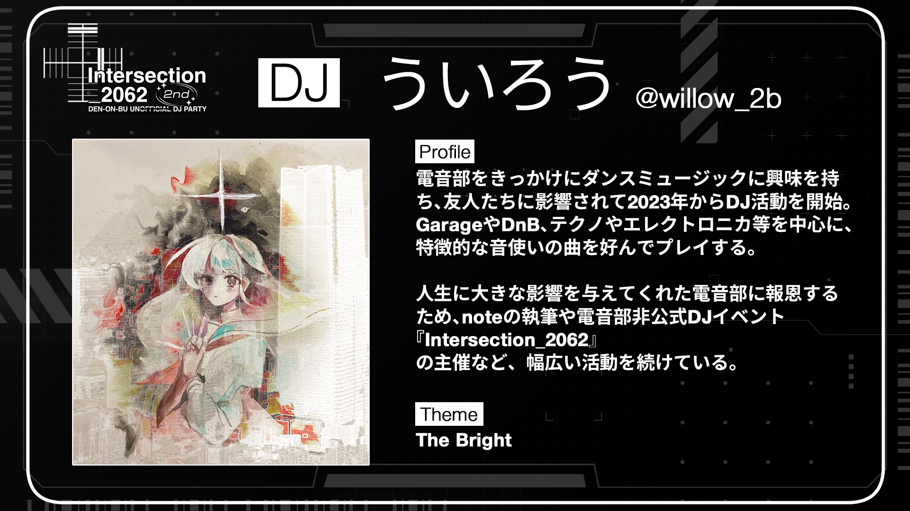

電音部をきっかけにダンスミュージックに興味を持ち、友人たちに影響されて2023年からDJ活動を開始。 
GarageやDnB、テクノやエレクトロニカ等を中心に、特徴的な音使いの曲を好んでプレイする。

人生に大きな影響を与えてくれた電音部に報恩するため、noteの執筆や電音部非公式DJイベント『Intersection_2062』の主催など、幅広い活動を続けている。

#### Theme
The Bright

<h2 id="vj">VJ</h2>

	<h3 id="72k">72K</h3> 
	

		<a href="https://x.com/72K_Nanika" target="_blank">
			Follow on Twitter
				<svg viewBox="0 0 16 16" aria-hidden="true" width="32" height="32"
					><path
						fill="currentColor"
						d="M5.026 15c6.038 0 9.341-5.003 9.341-9.334 0-.14 0-.282-.006-.422A6.685 6.685 0 0 0 16 3.542a6.658 6.658 0 0 1-1.889.518 3.301 3.301 0 0 0 1.447-1.817 6.533 6.533 0 0 1-2.087.793A3.286 3.286 0 0 0 7.875 6.03a9.325 9.325 0 0 1-6.767-3.429 3.289 3.289 0 0 0 1.018 4.382A3.323 3.323 0 0 1 .64 6.575v.045a3.288 3.288 0 0 0 2.632 3.218 3.203 3.203 0 0 1-.865.115 3.23 3.23 0 0 1-.614-.057 3.283 3.283 0 0 0 3.067 2.277A6.588 6.588 0 0 1 .78 13.58a6.32 6.32 0 0 1-.78-.045A9.344 9.344 0 0 0 5.026 15z"
					></path></svg
				>
		</a>
	

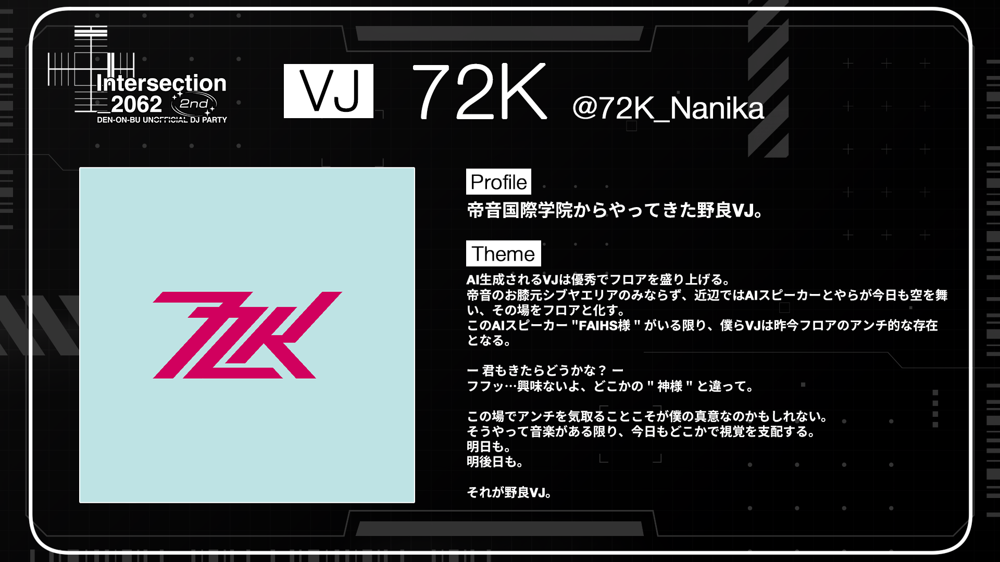

帝音国際学院からやってきた野良VJ。

#### Theme
AI生成されるVJは優秀でフロアを盛り上げる。 
帝音のお膝元シブヤエリアのみならず、近辺ではAIスピーカーとやらが今日も空を舞い、その場をフロアと化す。 
このAIスピーカー"FAIHS様"がいる限り、僕らVJは昨今フロアのアンチ的な存在となる。

ー 君もきたらどうかな？ ー
フフッ…興味ないよ、どこかの"神様"と違って。

この場でアンチを気取ることこそが僕の真意なのかもしれない。 
そうやって音楽がある限り、今日もどこかで視覚を支配する。 
明日も。 
明後日も。

それが野良VJ。

	<h3 id="maya">maya_Alukas</h3> 
	

		<a href="https://x.com/maya_Alukas" target="_blank">
			Follow on Twitter
				<svg viewBox="0 0 16 16" aria-hidden="true" width="32" height="32"
					><path
						fill="currentColor"
						d="M5.026 15c6.038 0 9.341-5.003 9.341-9.334 0-.14 0-.282-.006-.422A6.685 6.685 0 0 0 16 3.542a6.658 6.658 0 0 1-1.889.518 3.301 3.301 0 0 0 1.447-1.817 6.533 6.533 0 0 1-2.087.793A3.286 3.286 0 0 0 7.875 6.03a9.325 9.325 0 0 1-6.767-3.429 3.289 3.289 0 0 0 1.018 4.382A3.323 3.323 0 0 1 .64 6.575v.045a3.288 3.288 0 0 0 2.632 3.218 3.203 3.203 0 0 1-.865.115 3.23 3.23 0 0 1-.614-.057 3.283 3.283 0 0 0 3.067 2.277A6.588 6.588 0 0 1 .78 13.58a6.32 6.32 0 0 1-.78-.045A9.344 9.344 0 0 0 5.026 15z"
					></path></svg
				>
		</a>
	

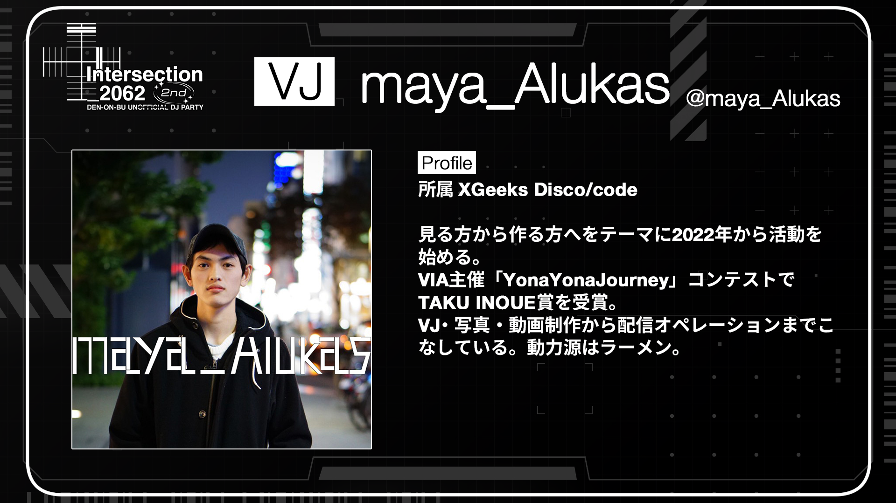

所属 XGeeks Disco/code

見る方から作る方へをテーマに2022年から活動を始める。 
VIA主催「YonaYonaJourney」コンテストでTAKU INOUE賞を受賞。 
VJ・写真・動画制作から配信オペレーションまでこなしている。動力源はラーメン。

	<h3 id="nemo">VJ Nemo</h3> 
	

		<a href="https://x.com/nemo_vj" target="_blank">
			Follow on Twitter
				<svg viewBox="0 0 16 16" aria-hidden="true" width="32" height="32"
					><path
						fill="currentColor"
						d="M5.026 15c6.038 0 9.341-5.003 9.341-9.334 0-.14 0-.282-.006-.422A6.685 6.685 0 0 0 16 3.542a6.658 6.658 0 0 1-1.889.518 3.301 3.301 0 0 0 1.447-1.817 6.533 6.533 0 0 1-2.087.793A3.286 3.286 0 0 0 7.875 6.03a9.325 9.325 0 0 1-6.767-3.429 3.289 3.289 0 0 0 1.018 4.382A3.323 3.323 0 0 1 .64 6.575v.045a3.288 3.288 0 0 0 2.632 3.218 3.203 3.203 0 0 1-.865.115 3.23 3.23 0 0 1-.614-.057 3.283 3.283 0 0 0 3.067 2.277A6.588 6.588 0 0 1 .78 13.58a6.32 6.32 0 0 1-.78-.045A9.344 9.344 0 0 0 5.026 15z"
					></path></svg
				>
		</a>
	

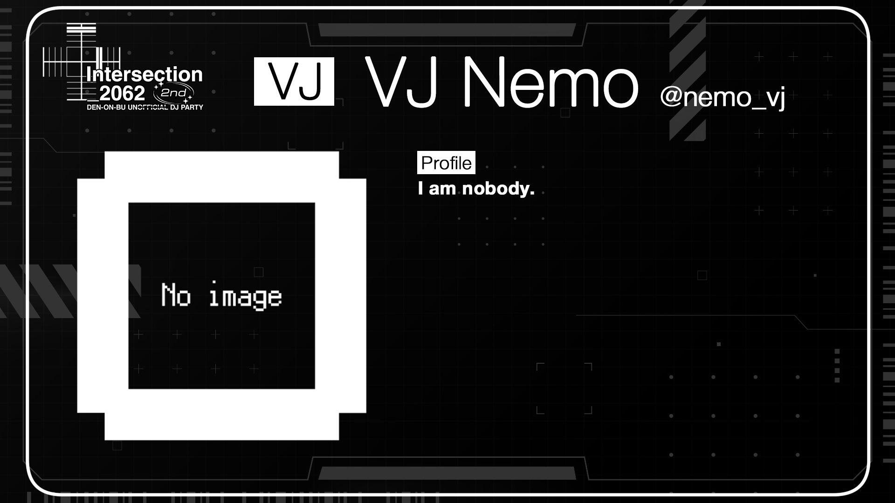

I am nobody.

<h2 id="lp">Live Painter's pick</h2>

	<h3 id="tattun">たっつん</h3> 
	

		<a href="https://x.com/Tattun319" target="_blank">
			Follow on Twitter
				<svg viewBox="0 0 16 16" aria-hidden="true" width="32" height="32"
					><path
						fill="currentColor"
						d="M5.026 15c6.038 0 9.341-5.003 9.341-9.334 0-.14 0-.282-.006-.422A6.685 6.685 0 0 0 16 3.542a6.658 6.658 0 0 1-1.889.518 3.301 3.301 0 0 0 1.447-1.817 6.533 6.533 0 0 1-2.087.793A3.286 3.286 0 0 0 7.875 6.03a9.325 9.325 0 0 1-6.767-3.429 3.289 3.289 0 0 0 1.018 4.382A3.323 3.323 0 0 1 .64 6.575v.045a3.288 3.288 0 0 0 2.632 3.218 3.203 3.203 0 0 1-.865.115 3.23 3.23 0 0 1-.614-.057 3.283 3.283 0 0 0 3.067 2.277A6.588 6.588 0 0 1 .78 13.58a6.32 6.32 0 0 1-.78-.045A9.344 9.344 0 0 0 5.026 15z"
					></path></svg
				>
		</a>
	

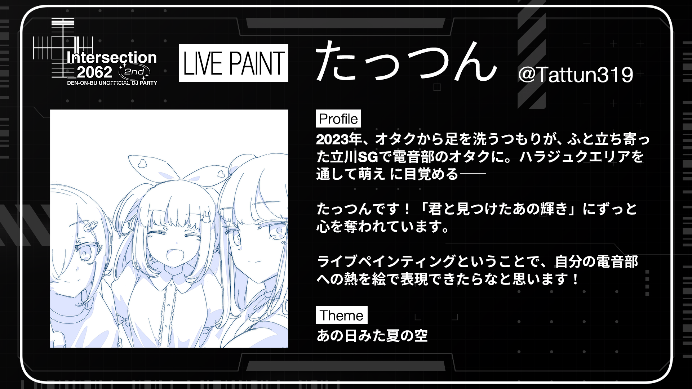

2023年、オタクから足を洗うつもりが、 ふと立ち寄った立川SGで電音部のオタクに。ハラジュクエリアを通して萌え に目覚める――

たっつんです！「君と見つけたあの輝き」にずっと心を奪われています。

ライブペインティングということで、自分の電音部への熱を絵で表現できたらなと思います！

#### Theme
あの日みた夏の空

