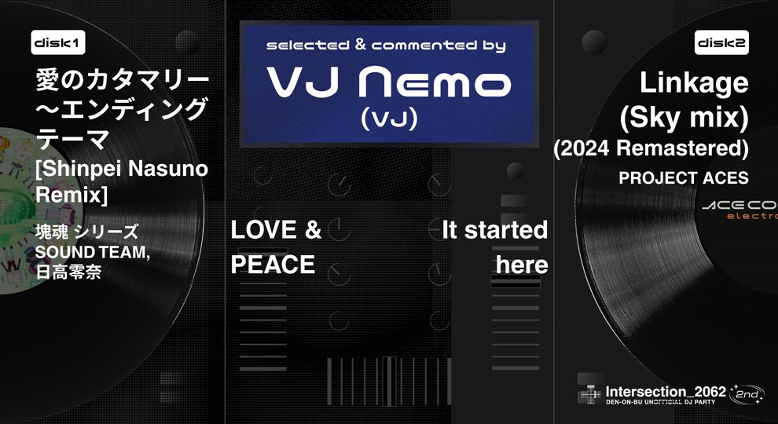

「Intersection_2062 2nd イベントプレイリスト企画」として、出演者の皆さまに「電音部の楽曲」と「電音部以外の楽曲」から1曲ずつ選曲していただきました。コメントも合わせて、当日の雰囲気を想像していただけますと幸いです！

<ol class="index">
    <h4>目次</h4>
    <li class="h2"><a href="#guestdj">Guest DJ's pick</a></li>
        <li>　<a href="#higma">higma (HyperBass, Dolphin)</a></li>
        <li>　<a href="#nuushi">NUU$HI (cyber*moon, Take A Chance)</a></li>
        <li>　<a href="#tatarayura">多々良ゆら (ALASKA, Mind Replacer)</a></li>
    <li class="h2"><a href="#dj">DJ's pick</a></li>
        <li>　<a href="#faio">FAIO (Favorite Days, Heart Beat)</a></li>
        <li>　<a href="#pogo">POGO (Haiiro no kokoro, No Gravity)</a></li>
        <li>　<a href="#macaneko">まかねこ (麻布アウトバーン, 四季ノ唄)</a></li>
        <li>　<a href="#shopon">しょうぽん (invisible, Echo)</a></li>
         <li>　<a href="#mery">めり (good night baby, Aidys Girls a Computer)</a></li>
        <li>　<a href="#willow">ういろう (Starchild, Day After Day)</a></li>
    <li class="h2"><a href="#vj">VJ's pick</a></li>
        <li>　<a href="#72k">72K (My Place, 七ツ風)</a></li>
        <li>　<a href="#maya">maya_Alukas (メタモルフォシス, Anchors up)</a></li>
        <li>　<a href="#nemo">VJ Nemo (愛のカタマリー ～エンディングテーマ, Linkage)</a></li>
    <li class="h2"><a href="#lp">Live Painter's pick</a></li>
        <li>　<a href="#tattun">たっつん (青雲リフレイン, ナイトレコード)</a></li>
    </li>
</ol>

 

<h2 id="guestdj">GUEST DJ's pick</h2>

    <h3 id="higma"> higma </h3> 
    

        <a href="https://x.com/pai_dareka" target="_blank">
            Follow on Twitter
            <svg viewBox="0 0 16 16" aria-hidden="true" width="32" height="32"
                ><path
                    fill="currentColor"
                    d="M5.026 15c6.038 0 9.341-5.003 9.341-9.334 0-.14 0-.282-.006-.422A6.685 6.685 0 0 0 16 3.542a6.658 6.658 0 0 1-1.889.518 3.301 3.301 0 0 0 1.447-1.817 6.533 6.533 0 0 1-2.087.793A3.286 3.286 0 0 0 7.875 6.03a9.325 9.325 0 0 1-6.767-3.429 3.289 3.289 0 0 0 1.018 4.382A3.323 3.323 0 0 1 .64 6.575v.045a3.288 3.288 0 0 0 2.632 3.218 3.203 3.203 0 0 1-.865.115 3.23 3.23 0 0 1-.614-.057 3.283 3.283 0 0 0 3.067 2.277A6.588 6.588 0 0 1 .78 13.58a6.32 6.32 0 0 1-.78-.045A9.344 9.344 0 0 0 5.026 15z"
                ></path></svg
            >
        </a>
    

    

#### Hyper Bass /Yunomi, 神宮前参道學園
当時ageHaで行われていた暴カワにリスナーとして行った時に、YunomiさんがHyper Bassを流しているのを聴いて衝撃を受けました。既にサブスクで聴いてはいましたが、ageHaのメインのあの大きいスピーカーで聴くHyper Bassは最高でした。それ以来ずっと大好きです。

#### Dolphin /Tennyson
とにかく音が良すぎるのと、アレンジがかなり複雑なのに踊れて最高です。

    <h3 id="nuushi">NUU$HI</h3>  
    

        <a href="https://x.com/IamNuushi" target="_blank">
            Follow on Twitter
            <svg viewBox="0 0 16 16" aria-hidden="true" width="32" height="32"
                ><path
                    fill="currentColor"
                    d="M5.026 15c6.038 0 9.341-5.003 9.341-9.334 0-.14 0-.282-.006-.422A6.685 6.685 0 0 0 16 3.542a6.658 6.658 0 0 1-1.889.518 3.301 3.301 0 0 0 1.447-1.817 6.533 6.533 0 0 1-2.087.793A3.286 3.286 0 0 0 7.875 6.03a9.325 9.325 0 0 1-6.767-3.429 3.289 3.289 0 0 0 1.018 4.382A3.323 3.323 0 0 1 .64 6.575v.045a3.288 3.288 0 0 0 2.632 3.218 3.203 3.203 0 0 1-.865.115 3.23 3.23 0 0 1-.614-.057 3.283 3.283 0 0 0 3.067 2.277A6.588 6.588 0 0 1 .78 13.58a6.32 6.32 0 0 1-.78-.045A9.344 9.344 0 0 0 5.026 15z"
                ></path></svg
            >
        </a>
    

#### cyber*moon (feat. 八波零音) /NUU$HI, 東京電脳
ここ最近私が提供した楽曲ですが、儚さや脆さと同時に力強さを表現したものになってます。
また八波零音役を担当してくれたyAmmyさんの美しい声が雰囲気をより良いものにしてくれたので僕にとっても印象深い作品です！

#### Take A Chance (feat. Little Dragon) /Flume
文句なしでこの曲が僕にとって音楽を作る上で何をやっても良いんだって教えてくれた曲です。
実験的なサウンドメイクや音楽的な部分においてどれを取っても完璧な曲だと思ってます。

	<h3 id="tatarayura">多々良ゆら</h3> 
	

		<a href="https://x.com/MSP_yura" target="_blank">
			Follow on Twitter
				<svg viewBox="0 0 16 16" aria-hidden="true" width="32" height="32"
					><path
						fill="currentColor"
						d="M5.026 15c6.038 0 9.341-5.003 9.341-9.334 0-.14 0-.282-.006-.422A6.685 6.685 0 0 0 16 3.542a6.658 6.658 0 0 1-1.889.518 3.301 3.301 0 0 0 1.447-1.817 6.533 6.533 0 0 1-2.087.793A3.286 3.286 0 0 0 7.875 6.03a9.325 9.325 0 0 1-6.767-3.429 3.289 3.289 0 0 0 1.018 4.382A3.323 3.323 0 0 1 .64 6.575v.045a3.288 3.288 0 0 0 2.632 3.218 3.203 3.203 0 0 1-.865.115 3.23 3.23 0 0 1-.614-.057 3.283 3.283 0 0 0 3.067 2.277A6.588 6.588 0 0 1 .78 13.58a6.32 6.32 0 0 1-.78-.045A9.344 9.344 0 0 0 5.026 15z"
					></path></svg
				>
		</a>
	

#### ALASKA /Ma’Scar’Piece, Funk Uchino, SILLY TEMBA, BLOCKYYY, Ayaka Miyake
「ALASKA」は、Ma’Scar’Pieceの新しい一面を感じられる曲だと思っています。ライブで一緒に踊ったり手を挙げたりして楽しめるのはもちろんですが、それだけでなく、儚さや青春のようないつか過ぎ去る切なさがあって、聴いていると心に残る歌詞やサウンドに注目してほしいです🤍

特に「失って初めて大切さに気づく」という歌詞は、初めて聴いたときから印象的で、傷や迷いを経験してきたからこそ生まれる音があり、それに共感できる人も多いと思います。その音が世界中に届きますように、とそんな願いが込められた「ALASKA」を、ぜひたくさん聴いてほしいです🤍

#### Mind Replacer /TEMPLIME, 星宮とと, SOZEN OSTUBO 
まず、私が星宮ととさんの大ファンであることがきっかけでこの曲を紹介させていただくことにしました🫶 この曲は音の作り込みが本当に素晴らしく、まるで音に包み込まれ、飲み込まれていくような没入感を味わえるのが大きな魅力です。白いキャンバスに線や形、色彩が次々と描かれていくかのように、音が鮮やかに広がり、脳の隅々まで刺激される感覚がたまらんのです❕❕ 聴いていると自然と創作意欲が湧き上がってくる上にMVもとっても素敵なのでぜひ観ていただきたいです🤍

<h2 id="dj">DJ's pick</h2>

	<h3 id="faio">FAIO</h3> 
	

		<a href="https://x.com/FAIO1230" target="_blank">
			Follow on Twitter
				<svg viewBox="0 0 16 16" aria-hidden="true" width="32" height="32"
					><path
						fill="currentColor"
						d="M5.026 15c6.038 0 9.341-5.003 9.341-9.334 0-.14 0-.282-.006-.422A6.685 6.685 0 0 0 16 3.542a6.658 6.658 0 0 1-1.889.518 3.301 3.301 0 0 0 1.447-1.817 6.533 6.533 0 0 1-2.087.793A3.286 3.286 0 0 0 7.875 6.03a9.325 9.325 0 0 1-6.767-3.429 3.289 3.289 0 0 0 1.018 4.382A3.323 3.323 0 0 1 .64 6.575v.045a3.288 3.288 0 0 0 2.632 3.218 3.203 3.203 0 0 1-.865.115 3.23 3.23 0 0 1-.614-.057 3.283 3.283 0 0 0 3.067 2.277A6.588 6.588 0 0 1 .78 13.58a6.32 6.32 0 0 1-.78-.045A9.344 9.344 0 0 0 5.026 15z"
					></path></svg
				>
		</a>
	

#### Favorite Days /kz, 日高零奈
音楽は、その「場所」に強く影響されるメディアだ。
例えば、教会では残響が長く残るという建築上の特性があるため、対位法という複数の旋律を鳴らすテクニックが発達した。
逆に、屋外で演奏される音楽では、旋律よりもリズムが発達した。
「場所」が影響を与えているという事実は、音響的な側面以外にも、カルチャーの側面からも考えることができる。
場所があり、人が集まり、営みが生まれる中でカルチャーが育っていく。
そして私たちはしばしば、そこで生まれたカルチャーの独自性を、音楽の形に落とし込み、発信をする。
その理由は様々だ。
ある時は主張を届けるため、仲間の士気を上げるため、存在を知り渡らせるため。
何れにせよ、カルチャーの存在が大きな影響を与えていることは確かだ。
さて、クラブミュージックは名の通りクラブという「場所」で再生されることを目的として作られた音楽だ。
そして、その特徴の中に、細分化されたジャンルが非常に多いことが挙げられるだろう。
ハウスと一口に言っても、エレクトロ・ハウスや、プログレッシヴ・ハウス、フューチャー・ハウスなど多くの種類がある。また、そこから派生し、時に融合し、新たなジャンルが生まれることもある。きっとまだまだこの先もジャンルは増えていくだろう。
ジャンルが多く生まれる理由の一つとして、クラブという「場所」の特性がこれにもまた関わっているのではないだろうか。
閉じた空間の中でコミュニティが形成され、そこからカルチャーが興る。
そしてその単位が、無数にある「クラブ」なのだと考えたら、ジャンルが多くなることも容易に想像がつくだろう。
ハウスというジャンル名は、シカゴのクラブ「ウェアハウス」が由来だと言われている。

2020年。未曾有の事態で私たちは分断されてしまった。
そしてその分断は、多くのクラブを危機へと陥れることになった。
継続が難しくなり、閉店してしまったクラブも少なくない。
取り壊され、今では二度と見ることのできなくなってしまった光景も数多くあるだろう。
しかし、その中で生まれた音楽は消えることはなかった。
あの日の光景を思い出すために、または後の世代へと継いでいくために。
また或いは、自分の信じる音楽を、己の矜持を照明するために。
私たちは「PLAY/PAUSE」のボタンを押して、今日もフロアのスピーカーを振動させる。

いつかまた、未曾有の事態が再び世界を襲うかもしれない。
私たちが立っているこのフロアも無くなってしまうかもしれない。
けれども、私たちが音楽を止めない限り、カルチャーが途絶えることはないはずだ。
だから、この「場所」で踊り続けよう。
ミラーボールも輝くほどに、ずっと。

#### Heart Beat /livetune(kz), 初音ミク
イベントは始まったら最後、終わりの時間が来てしまう。
私たちはその帰路の中で、色々な思いを抱える。
今日を思い返す人もいれば、新たな目標を抱く人もいるかもしれない。
それでも、終わりが来るということは、やがて新しい始まりも来ることになる。
だからまた、その瞬間が来ることを祈り、願い、期待を胸に抱いて。
まだ覚えているあのベースラインを思い返しながら、今日もまた歩いていく。

	<h3 id="pogo">POGO</h3>  
	

		<a href="https://x.com/pogo_voc" target="_blank">
			Follow on Twitter
				<svg viewBox="0 0 16 16" aria-hidden="true" width="32" height="32"
					><path
						fill="currentColor"
						d="M5.026 15c6.038 0 9.341-5.003 9.341-9.334 0-.14 0-.282-.006-.422A6.685 6.685 0 0 0 16 3.542a6.658 6.658 0 0 1-1.889.518 3.301 3.301 0 0 0 1.447-1.817 6.533 6.533 0 0 1-2.087.793A3.286 3.286 0 0 0 7.875 6.03a9.325 9.325 0 0 1-6.767-3.429 3.289 3.289 0 0 0 1.018 4.382A3.323 3.323 0 0 1 .64 6.575v.045a3.288 3.288 0 0 0 2.632 3.218 3.203 3.203 0 0 1-.865.115 3.23 3.23 0 0 1-.614-.057 3.283 3.283 0 0 0 3.067 2.277A6.588 6.588 0 0 1 .78 13.58a6.32 6.32 0 0 1-.78-.045A9.344 9.344 0 0 0 5.026 15z"
					></path></svg
				>
		</a>
	

#### Haiiro no kokoro /パソコン音楽クラブ, 灰島銀華
灰色の心抱きしめて←ありがとう
臆病な僕を認めて←ありがとう
本当の「わたし」 いつか見せよう←ありがとう

#### No Gravity(feat. Catarrh Nisin)[Masayoshi Iimori Remix] /Savage States
電音部4thライブ特典のGR Remix盤にも楽曲提供した、アメ村を代表するHardtekトラックメイカーSavageStatesと SprayBoxからリリースされた"Pull Out the Gunfingers"がUKGシーンでスーパーアンセムとなっている神戸在住GrimeラッパーCatarrh Nisinによるコラボスーパーバンガーチューン！！
両者ともUK現地のフェスやパーティでの多数出演やアーティストとの交流も深く、日本とUKバイブスを繋げる仕掛け人としてアメ村のシーンを代表する大先輩です！

そしてさらにこのトラックは電音部シーズン0アルバムの特典Remixにも楽曲提供したTREKKIE TRAXのMasayoshi IimoriによるRemix！！ガチガチのローが鳴るDnBで皆と踊りたい！！

	<h3 id="macaneko">まかねこ</h3> 
	

		<a href="https://x.com/macat_255" target="_blank">
			Follow on Twitter
				<svg viewBox="0 0 16 16" aria-hidden="true" width="32" height="32"
					><path
						fill="currentColor"
						d="M5.026 15c6.038 0 9.341-5.003 9.341-9.334 0-.14 0-.282-.006-.422A6.685 6.685 0 0 0 16 3.542a6.658 6.658 0 0 1-1.889.518 3.301 3.301 0 0 0 1.447-1.817 6.533 6.533 0 0 1-2.087.793A3.286 3.286 0 0 0 7.875 6.03a9.325 9.325 0 0 1-6.767-3.429 3.289 3.289 0 0 0 1.018 4.382A3.323 3.323 0 0 1 .64 6.575v.045a3.288 3.288 0 0 0 2.632 3.218 3.203 3.203 0 0 1-.865.115 3.23 3.23 0 0 1-.614-.057 3.283 3.283 0 0 0 3.067 2.277A6.588 6.588 0 0 1 .78 13.58a6.32 6.32 0 0 1-.78-.045A9.344 9.344 0 0 0 5.026 15z"
					></path></svg
				>
		</a>
	

#### 麻布アウトバーン /ケンモチヒデフミ, 港白金女学院
バンダイナムコエンターテインメントフェスティバル2nd(2022年5月)で、私の心を撃ち抜いた楽曲です。会場で初めてこの曲を聴いた時の衝撃は、3年以上が経った今でも鮮明に思い出せるほどです。
胸にずっしりとくるベースと、光り煌めくようなシンセやピアノのメロディ、疾走感のあるドラムパターン。それらにアザブエリアの面々のボーカルが加わり、音楽を構成する全てが輝いて見えました。
何より、最初のエリア楽曲『Where Is The Love』で終わりを見据えていたアザブエリアが、「終わらない」「終われない」と力強く歌っているんです。この変化がたまらなく嬉しくて、でもきっと3人には『Where Is The Love』のような未来が訪れるんだろうな、という切ない想像も頭をよぎり、とても複雑な気持ちになります。
アザブエリアの3人は、高校生にして既に大人の事情やビジネスの世界などに触れていて、感情や熱意だけではどうにもならないことがあることを知っているような、ある種世界への諦観や達観を抱えていると思っています。
そんな3人が、等身大の自分をさらけ出し、青春の全てをかけて手に入れたいものに走っているような、光っているような情景を想起させるこの曲が大好きです。

#### 四季ノ唄 /MINMI
ジャズやレゲエを思わせるビートと、大人っぽくて切ない女性ボーカル……夜明けのラウンジで聴きたくなるような、儚さと少しの気だるさを感じる楽曲です。
とてもお洒落で、聴いているとなんだか大人の女性になったような気分に陥るのですが、実はこの曲、原曲のアニソンなのです…！
『サムライチャンプルー』という、2004年に放送されていたアニメのエンディングテーマで、劇伴を担当したNujabesとのコラボで生まれた楽曲です。
アニメでありながら、ダンスミュージックのシーンで活躍されていたトラックメイカー・DJが楽曲プロデュースを担当している点に電音部とのつながりを感じ、お気に入りの曲の中からこちらを選曲しました！
ちょうどこれから秋から冬へと変わっていく時期ですので、季節の移ろいを感じる流れるようなフロウにも是非注目して聴いてみてください！

	<h3 id="shopon">しょうぽん</h3> 
	

		<a href="https://x.com/shopon1201" target="_blank">
			Follow on Twitter
				<svg viewBox="0 0 16 16" aria-hidden="true" width="32" height="32"
					><path
						fill="currentColor"
						d="M5.026 15c6.038 0 9.341-5.003 9.341-9.334 0-.14 0-.282-.006-.422A6.685 6.685 0 0 0 16 3.542a6.658 6.658 0 0 1-1.889.518 3.301 3.301 0 0 0 1.447-1.817 6.533 6.533 0 0 1-2.087.793A3.286 3.286 0 0 0 7.875 6.03a9.325 9.325 0 0 1-6.767-3.429 3.289 3.289 0 0 0 1.018 4.382A3.323 3.323 0 0 1 .64 6.575v.045a3.288 3.288 0 0 0 2.632 3.218 3.203 3.203 0 0 1-.865.115 3.23 3.23 0 0 1-.614-.057 3.283 3.283 0 0 0 3.067 2.277A6.588 6.588 0 0 1 .78 13.58a6.32 6.32 0 0 1-.78-.045A9.344 9.344 0 0 0 5.026 15z"
					></path></svg
				>
		</a>
	

#### invisible /東京電脳
物語の盛り上がりを感じられる曲調と電音部の世界って結構冷たいなと思える歌詞が好きな曲です。良くも悪くも技術発達した近未来だけどその時代を生きる人の悩みや感傷は変わりなくて、根本的には何も解決していない。そんな世界の中でも少女達は音楽とともに前を向いて成長していくような歌詞に物語の進行を感じられる曲調が合わさって、まだ明確に物語の描かれていない東京電脳における少女たちの葛藤やそこから始まる物語の広がりを無数に妄想できる曲だと思います。

#### Echo（feat. MONICO）/KOTONOHOUSE 
KOTONOHOUSEさんの踊れる曲調と音によって進んでいく物語を感じられる歌詞が好きな曲です。音との遭遇や自分の声によって進んでいく物語、もうそれって電音(ry…。

	<h3 id="mery">めり</h3> 
	

		<a href="https://x.com/d1ggtter" target="_blank">
			Follow on Twitter
				<svg viewBox="0 0 16 16" aria-hidden="true" width="32" height="32"
					><path
						fill="currentColor"
						d="M5.026 15c6.038 0 9.341-5.003 9.341-9.334 0-.14 0-.282-.006-.422A6.685 6.685 0 0 0 16 3.542a6.658 6.658 0 0 1-1.889.518 3.301 3.301 0 0 0 1.447-1.817 6.533 6.533 0 0 1-2.087.793A3.286 3.286 0 0 0 7.875 6.03a9.325 9.325 0 0 1-6.767-3.429 3.289 3.289 0 0 0 1.018 4.382A3.323 3.323 0 0 1 .64 6.575v.045a3.288 3.288 0 0 0 2.632 3.218 3.203 3.203 0 0 1-.865.115 3.23 3.23 0 0 1-.614-.057 3.283 3.283 0 0 0 3.067 2.277A6.588 6.588 0 0 1 .78 13.58a6.32 6.32 0 0 1-.78-.045A9.344 9.344 0 0 0 5.026 15z"
					></path></svg
				>
		</a>
	

#### good night baby /Moe Shop, 犬吠埼紫杏
この曲を聴くたびに、犬吠埼紫杏さんのことが好きだな、と思います。
科学技術が発展した2062年、どこか空虚感があるのは紫杏だけではないでしょう。しかし、紫杏は「道徳のない僕らの「正義」エゴばかりの常識」と世界に絶望しつつ、それでも「人生は捨てたもんじゃない」と愛を信じています。そして、心から希望を持てるまでの時間、助けになってくれるのが音楽だというわけです。
私にとって『good night baby』は、人間の、愛の、音楽の讃歌として、5年間響き続けています。

#### Aidys Girl's a Computer /Darkstar
その静謐さと特徴的なメロディーパターンから、DJで使うのが難しめなので、文面で好きな曲と言われるとどうしても紹介したくなる曲です。今回もDJでは流さないと思います。
どこか物悲しくて機械的な雰囲気のなかに、郷愁のようなものを感じるのが素敵です。ずっと歌詞ばかり読んでいた私ですが、この曲をきっかけに音で感じる物語を知りました。
こういう曲をもっと知りたい！ なんて調べたら出てきますか？？

	<h3 id="willow">ういろう</h3> 
	

		<a href="https://x.com/willow_2b" target="_blank">
			Follow on Twitter
				<svg viewBox="0 0 16 16" aria-hidden="true" width="32" height="32"
					><path
						fill="currentColor"
						d="M5.026 15c6.038 0 9.341-5.003 9.341-9.334 0-.14 0-.282-.006-.422A6.685 6.685 0 0 0 16 3.542a6.658 6.658 0 0 1-1.889.518 3.301 3.301 0 0 0 1.447-1.817 6.533 6.533 0 0 1-2.087.793A3.286 3.286 0 0 0 7.875 6.03a9.325 9.325 0 0 1-6.767-3.429 3.289 3.289 0 0 0 1.018 4.382A3.323 3.323 0 0 1 .64 6.575v.045a3.288 3.288 0 0 0 2.632 3.218 3.203 3.203 0 0 1-.865.115 3.23 3.23 0 0 1-.614-.057 3.283 3.283 0 0 0 3.067 2.277A6.588 6.588 0 0 1 .78 13.58a6.32 6.32 0 0 1-.78-.045A9.344 9.344 0 0 0 5.026 15z"
					></path></svg
				>
		</a>
	

#### Starchild /日高零奈
『電音部』という物語を表象する歌詞は『You Are The Light』などを含めて沢山ありますが、その中でも
「キミが誰かの背中見つめてるとき キミも誰かのポラリス」
というフレーズは、人から人へ受け継がれる想いという点で電音部第2部の物語をこれ以上なく簡潔に表していると感じたからです。
日高零奈さんだけでなく、それこそ『なつそらとわたし』で披露した時のように、ハラジュクエリアの皆さんや他のエリアの方々、延いては2062年という、呆れ返るほど自由な世界で夢に手を伸ばす人全員にピッタリな歌だと思っています。

#### Day After Day feat.高橋芽以 /パソコン音楽クラブ
フィクションみたいな鮮烈な出来事は起きないけれど、それでも日々に散らばる小さな幸せの欠片をかき集めて、明日を生きる活力としたい。
そういう、何気ない毎日を生きる上でのささやかな願いが封じ込められた素敵な歌詞だと思うからです。

<h2 id="vj">VJ's pick</h2>

	<h3 id="72k">72K</h3> 
	

		<a href="https://x.com/72K_Nanika" target="_blank">
			Follow on Twitter
				<svg viewBox="0 0 16 16" aria-hidden="true" width="32" height="32"
					><path
						fill="currentColor"
						d="M5.026 15c6.038 0 9.341-5.003 9.341-9.334 0-.14 0-.282-.006-.422A6.685 6.685 0 0 0 16 3.542a6.658 6.658 0 0 1-1.889.518 3.301 3.301 0 0 0 1.447-1.817 6.533 6.533 0 0 1-2.087.793A3.286 3.286 0 0 0 7.875 6.03a9.325 9.325 0 0 1-6.767-3.429 3.289 3.289 0 0 0 1.018 4.382A3.323 3.323 0 0 1 .64 6.575v.045a3.288 3.288 0 0 0 2.632 3.218 3.203 3.203 0 0 1-.865.115 3.23 3.23 0 0 1-.614-.057 3.283 3.283 0 0 0 3.067 2.277A6.588 6.588 0 0 1 .78 13.58a6.32 6.32 0 0 1-.78-.045A9.344 9.344 0 0 0 5.026 15z"
					></path></svg
				>
		</a>
	

#### My Place /PICASONIC, nakotanmaru, 鳳凰火凛
本当に電音部でのPIKASONICさんの楽曲を待ちわびてました！！！
nakotanmaruさんが描く孤独な闘いをしていた"最強"の"成長"を綴るLyricが本当に染み渡る1曲です！！！
いろいろ言いたいことはあるのですが、電音部ノベル第2部のネタバレ回避のためあまり語れないので、ぜひ、電音部ノベル第2部やこれまでの電音部楽曲（特にシブヤエリアや鳳凰火凛ソロの楽曲）と一緒にお楽しみください！！！
…おかえり、火凛。

#### 七ツ風 /ナナツカゼ
文脈的には"一透星"を挙げるべきなのかもしれませんがこちらの楽曲を紹介させてください。
My Placeで紹介した、PIKASONICさんとnakotanmaruさんのナナツカゼの楽曲。
秋の切ない"和"×"FutureBass"×"Rock"。
"七ツ風"のひとつの物語なのかなと思います。
他のナナツカゼ楽曲とは結構異なりますが、七ツ風からでも、ほかの楽曲からでもいいのでナナツカゼを聴いてほしいです。
そして、Spotifyで紹介されていると思いますが、omyさんが描く"七ツ風"も感じてほしいので、ぜひYouTubeのMVも見てほしいです。
ようやくこの楽曲が染み渡るぐらい涼しくなってきましたね。
いつまでも物語の二人には一緒であってほしい…です。
…ありがとうございます、ナナツカゼ。

	<h3 id="maya">maya_Alukas</h3> 
	

		<a href="https://x.com/maya_Alukas" target="_blank">
			Follow on Twitter
				<svg viewBox="0 0 16 16" aria-hidden="true" width="32" height="32"
					><path
						fill="currentColor"
						d="M5.026 15c6.038 0 9.341-5.003 9.341-9.334 0-.14 0-.282-.006-.422A6.685 6.685 0 0 0 16 3.542a6.658 6.658 0 0 1-1.889.518 3.301 3.301 0 0 0 1.447-1.817 6.533 6.533 0 0 1-2.087.793A3.286 3.286 0 0 0 7.875 6.03a9.325 9.325 0 0 1-6.767-3.429 3.289 3.289 0 0 0 1.018 4.382A3.323 3.323 0 0 1 .64 6.575v.045a3.288 3.288 0 0 0 2.632 3.218 3.203 3.203 0 0 1-.865.115 3.23 3.23 0 0 1-.614-.057 3.283 3.283 0 0 0 3.067 2.277A6.588 6.588 0 0 1 .78 13.58a6.32 6.32 0 0 1-.78-.045A9.344 9.344 0 0 0 5.026 15z"
					></path></svg
				>
		</a>
	

#### メタモルフォシス /Zekk, 東雲和音
なんかいいよね

#### Anchors up /YSS 
最近こういうのキテます

	<h3 id="nemo">VJ Nemo</h3> 
	

		<a href="https://x.com/nemo_vj" target="_blank">
			Follow on Twitter
				<svg viewBox="0 0 16 16" aria-hidden="true" width="32" height="32"
					><path
						fill="currentColor"
						d="M5.026 15c6.038 0 9.341-5.003 9.341-9.334 0-.14 0-.282-.006-.422A6.685 6.685 0 0 0 16 3.542a6.658 6.658 0 0 1-1.889.518 3.301 3.301 0 0 0 1.447-1.817 6.533 6.533 0 0 1-2.087.793A3.286 3.286 0 0 0 7.875 6.03a9.325 9.325 0 0 1-6.767-3.429 3.289 3.289 0 0 0 1.018 4.382A3.323 3.323 0 0 1 .64 6.575v.045a3.288 3.288 0 0 0 2.632 3.218 3.203 3.203 0 0 1-.865.115 3.23 3.23 0 0 1-.614-.057 3.283 3.283 0 0 0 3.067 2.277A6.588 6.588 0 0 1 .78 13.58a6.32 6.32 0 0 1-.78-.045A9.344 9.344 0 0 0 5.026 15z"
					></path></svg
				>
		</a>
	

#### 愛のカタマリー ～エンディングテーマ[Shinpei Nasuno Remix] /塊魂シリーズSOUND TEAM, 日高零奈
LOVE & PEACE

#### Linkage(Sky mix) (2024 Remastered) /PROJECT ACES
It started here

<h2 id="lp">Live Painter's pick</h2>

	<h3 id="tattun">たっつん</h3> 
	

		<a href="https://x.com/Tattun319" target="_blank">
			Follow on Twitter
				<svg viewBox="0 0 16 16" aria-hidden="true" width="32" height="32"
					><path
						fill="currentColor"
						d="M5.026 15c6.038 0 9.341-5.003 9.341-9.334 0-.14 0-.282-.006-.422A6.685 6.685 0 0 0 16 3.542a6.658 6.658 0 0 1-1.889.518 3.301 3.301 0 0 0 1.447-1.817 6.533 6.533 0 0 1-2.087.793A3.286 3.286 0 0 0 7.875 6.03a9.325 9.325 0 0 1-6.767-3.429 3.289 3.289 0 0 0 1.018 4.382A3.323 3.323 0 0 1 .64 6.575v.045a3.288 3.288 0 0 0 2.632 3.218 3.203 3.203 0 0 1-.865.115 3.23 3.23 0 0 1-.614-.057 3.283 3.283 0 0 0 3.067 2.277A6.588 6.588 0 0 1 .78 13.58a6.32 6.32 0 0 1-.78-.045A9.344 9.344 0 0 0 5.026 15z"
					></path></svg
				>
		</a>
	

#### 青雲リフレイン /picco, 中野電脳
一度聴いたら忘れないメロディー、キャラクターそれぞれの思いや葛藤が込められた歌詞、ステージ上でのパフォーマンスも合わさって大好きな曲です。
「ありもしない声にどうか耳を向けないで 聴こえてるはずだ心繋ぐフレーズが」←ここで2人が語りかける構図があまりにも美しい。この曲から電音部4thLIVEが始まったのもいい思い出です。

#### ナイトレコード /higma
夜を泳ぐような曲の雰囲気、MVとのシンクロ具合も大好きです。
「普通が出来ない」と思い悩み、夜を歩いていそうなあのキャラクターを思いながら聴いています。
「いつの間にか探していた答えは ここにあったようで」←ここが大好き。

