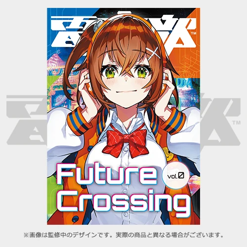

今回は、イベント名「Intersection_2062」の由来についてお話します。

#### 1.原点は『Intersection by Sho Okada』と『Future Crossing』
<iframe width=device-width src="https://www.youtube.com/embed/zCOtOWtOhfo?si=Dn8N8OUcTvaBqBGZ" title="YouTube video player" frameborder="0" allow="accelerometer; autoplay; clipboard-write; encrypted-media; gyroscope; picture-in-picture; web-share" referrerpolicy="strict-origin-when-cross-origin" allowfullscreen></iframe>

**"Intersection"とは、日本語で「交差点」を意味する英単語** です。 
電音部で「Intersection」といえば、**[『Intersection by Sho Okada』](https://nex-tone.link/A00092866)**。『電音部 1st LIVE -Make Waves-』用に岡田祥さんが制作したインスト曲です。1st LIVEのオープニングに流れた曲であり、 **「電音部とは何か」** を端的に表した曲だと言えるでしょう。我々はそのタイトルとして名付けられた **「Intersection」** という単語を、電音部という物語を表象する重要なワードであると解釈しました。

2021年に発売された電音部の公式ムック本には、 **『Future Crossing Vol.0 アキバ編』** というタイトルがつけられていました。 
「Crossing」は「Intersection」と同じく、「交差点」を意味する単語。直訳すると、 **「未来の交差点」** です。 
実は、初期案としてこの「Future Crossing」をもじるというのがありました。ただ、意味はそのままに少し捻って、 **「Intersection_2062」に決定** 。ほかの電音部ファンイベントとの差別化もでき、良いタイトルなのではと思っています。

#### 2.なぜ「交差点」は電音部のキーワードなのか ――Intersection_2062主催なりの解釈――

それでは、なぜ電音部は「交差点」をキーワードとしているのでしょうか。それは、初期から言われ続けているテーマ **「音楽遭遇」** や **「DJ」という行為の特性** に基づくものであると考えます。

<iframe width=device-width src="https://www.youtube.com/embed/PNlzvFubggk?si=k9ZZfH_0B5q1vQGx" title="YouTube video player" frameborder="0" allow="accelerometer; autoplay; clipboard-write; encrypted-media; gyroscope; picture-in-picture; web-share" referrerpolicy="strict-origin-when-cross-origin" allowfullscreen></iframe>

**[『ぺトリコールを渡って』](https://nex-tone.link/A92197)** で海月が零奈に出会うように、交差点は人と人が“遭遇”する場所です。「遭遇」といえば、 **電音部が初期から掲げているテーマ「音楽に遭遇しよう」** 。 
キャラクターコンテンツをきっかけに新しい音楽に出会うこと、物語を通して音楽を深く感じること、それが電音部の目的であり、魅力であると考えます。

DJは、曲と曲を重ねて——「交差させて」、自分の世界観を表現したり、心地よい空間をつくったりする行為です。観衆は、楽曲が切り替わるたびに音楽の交差点に立っているといえます。 

<iframe width=device-width src="https://www.youtube.com/embed/4hi8XoKHzsA?si=xouhlA6_DP4Y24XZ" title="YouTube video player" frameborder="0" allow="accelerometer; autoplay; clipboard-write; encrypted-media; gyroscope; picture-in-picture; web-share" referrerpolicy="strict-origin-when-cross-origin" allowfullscreen></iframe>

楽曲をつなぐとき、DJは交わる2曲のBPMやキーを合わせます。 
電音部における交差点は、ただ遭遇するだけでなく、 **理解し合い、分かち合う場所の象徴** なのではないでしょうか。『ぺトリコールを渡って』のアンサーソングである『going...』で、信号が青になるように。

Intersection_2062が、みなさまにとっての交差点となれますように。そんな思いでお待ちしております。